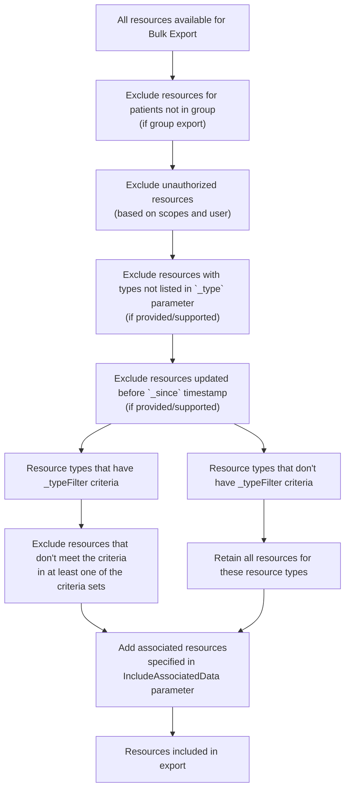

```mermaid
flowchart TB
    all[All resources available for Bulk Export]
    group["Exclude resources for patients not in group\n(if group export)"]
    authz["Exclude unauthorized resources\n(based on scopes and user)"]
    type["Exclude resources with types not listed in `_type` parameter\n(if provided/supported)"]
    since["Exclude resources updated before `_since` timestamp\n(if provided/supported)"]
    typefilter_criteria[Resource types that have _typeFilter criteria]
    typefilter_filter[Exclude resources that don't meet the criteria\nin at least one of the criteria sets]
    typefilter_no_criteria[Resource types that don't have _typeFilter criteria]
    typefilter_no_filter[Retain all resources for these resource types]
    iad[Add associated resources\nspecified in IncludeAssociatedData parameter]
    return[Resources included in export]
    all --> group --> authz --> type --> since --> typefilter_criteria --> typefilter_filter --> iad
    since --> typefilter_no_criteria --> typefilter_no_filter --> iad
    iad --> return
```