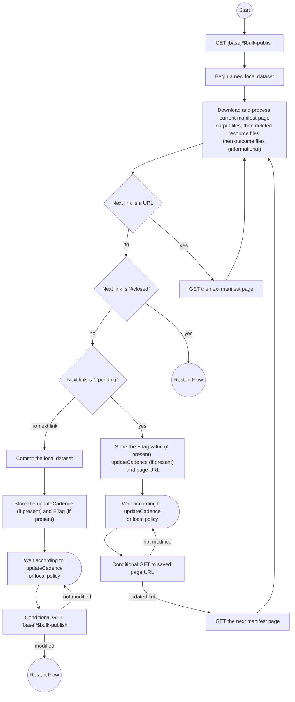

```mermaid
flowchart TD
    requestRoot["GET [base]/$bulk-publish"]
    startDataset["Begin a new local dataset"]
    processPage["Download and process current manifest page<br/>output files, then deleted resource files,<br/>then outcome files (informational)"]
    hasAbsoluteLink{"Next link is a URL"}
    hasClosedLink{"Next link is `#closed`"}
    hasPendingLink{"Next link is `#pending`"}
    start@{shape: "circle", label: "Start"}
    getNext["GET the next manifest page"]
    closedRestart@{shape: "circle", label: "Restart Flow"}
    commitDataset["Commit the local dataset"]
    saveRoot["Store the updateCadence (if present) and ETag (if present)"]
    waitRoot@{shape: delay, label: "Wait according to updateCadence<br/>or local policy"}
    pollRoot["Conditional GET [base]/$bulk-publish"]
    restartFlow@{shape: "circle", label: "Restart Flow"}
    savePending["Store the ETag value (if present),<br/>updateCadence (if present)<br/> and page URL"]
    waitPending@{shape: delay, label: "Wait according to updateCadence<br/>or local policy"}
    pollPending["Conditional GET to saved page URL"]
    pollRetrieve["GET the next manifest page"]

    start --> requestRoot --> startDataset --> processPage --> hasAbsoluteLink

    hasAbsoluteLink --> |yes| getNext
    getNext --> processPage
    hasAbsoluteLink --> |no| hasClosedLink

    hasClosedLink --> |no| hasPendingLink
    hasClosedLink --> |yes| closedRestart

    hasPendingLink --> |no next link| commitDataset
    commitDataset --> saveRoot
    saveRoot --> waitRoot
    waitRoot --> pollRoot
    pollRoot --> |not modified| waitRoot
    pollRoot --> |modified| restartFlow

    hasPendingLink --> |yes| savePending
    savePending --> waitPending
    waitPending --> pollPending
    pollPending --> |not modified| waitPending
    pollPending --> |updated link| pollRetrieve
    pollRetrieve --> processPage

```
